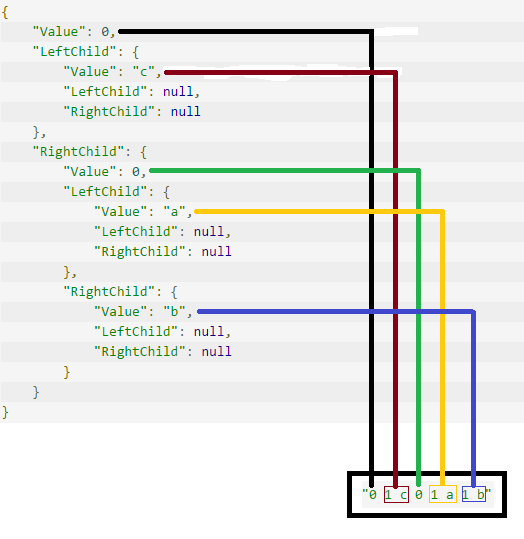

# Huffman

Programa que codifica e decodifica textos ASCII utilizando o método de codificação Huffman.

## Pré-requisitos

- Windows x64

## Comprimir em códificação Huffman

Para comprimir um arquivo basta executar a seguinte linha de comando (neste diretório):

    node main.js file >> outputfile

Exemplo:

    node main.js sample2.txt >> .data

## Descomprimir

    node main.js .data --decode >> decoded.txt

## Testar compressão em um arquivo

    node main.js sample2.txt --test

Este comando joga na saída uma estátisca como por exemplo:

    sample2.txt : 3165  bytes
    encoded : 1744  bytes
    decoded == original: true
    Tamanho do arquivo após códificação: 55.102685624012636 %

---

### Exmplicação sobre a serialização da árvore:

Dada a seguinte arvore:

    var tree = ['c', ['a', 'b'], ['d', 'g']];

Converte-se ela para Objetos do tipo TreeNode:

    function ArrayToTreeNode(table) {
        var value = table;
        if (Array.isArray(value)) {
            return new TreeNode(0, ArrayToTreeNode(value[0]), ArrayToTreeNode(value[1]));
        } else {
            return new TreeNode(value, null, null);
        }
    };
    var root = ArrayToTreeNode(tree);
    console.log(JSON.stringify(root, null, 4));

Como fica a arvore:

    {                              
        "Value": 0,                
        "LeftChild": {             
            "Value": "c",          
            "LeftChild": null,     
            "RightChild": null     
        },                         
        "RightChild": {            
            "Value": 0,            
            "LeftChild": {         
                "Value": "a",      
                "LeftChild": null, 
                "RightChild": null 
            },                     
            "RightChild": {        
                "Value": "b",      
                "LeftChild": null, 
                "RightChild": null 
            }                      
        }                          
    }                              

Para serializar esta arvóre usa-se o seguinte código:

    // Modifiquei esse cara pra escrever uma string concatenando o bit que diz se é folha ou não e o valor como caracter pra ficar mais fácil de entender, mas teria que ser realiza a conversao pra binario desta 'fita'. Se quiser ver como eu fiz em Node tem no link https://github.com/eberlitz/huffman/blob/master/tree.ts
    class BitBuffer {
        data: string = '';
        cursor: number = 0;
    
        WriteBit(bit: number) {
            this.data += ' ' + bit.toString();
        }
    
        WriteByte(value: number) {
            this.data += ' ' + value;
        }
    }
    
    function EncodeNode(node: TreeNode, writer: BitBuffer) {
        if (node.IsLeafNode()) {
            writer.WriteBit(1);
            writer.WriteByte(node.Value);
        }
        else {
            writer.WriteBit(0);
            EncodeNode(node.LeftChild, writer);
            EncodeNode(node.RightChild, writer);
        }
    }

Para serializar então:

    var bitBuffer = new BitBuffer();
    EncodeNode(root, bitBuffer);
    
    console.log(bitBuffer.data);

Resultado final:

    "0 1 c 0 1 a 1 b"

Comparando a arvore com o resultado:

Ou seja pra ler é feito da mesma maneira só que gera da tripa os objetos.

E no caso, quando for gravar em arquivo mesmo, tu concatena num buffer os bits e bytes exemplo

Convertendo para o código da tabela ASCII

    "0 1 99 0 1 97 1 98"

Convertendo para binário

    "0 1 1100011 0 1 1100001 1 1100010"

Agora junta-se tudo removendo os espaços:

    "01110001101110000111100010"

Para gravar em arquivo (no Node ao menos) tem que ser múltiplo de 8 bits então adiciona 0 no final até fechar

    "01110001 10111000 01111000 10000000"

Assim converte-se para hexadecimal para salvar no arquivo

    0x71 0xB8 0x78 0x80

Para ler é só fazer todo o processo ao contrário.

